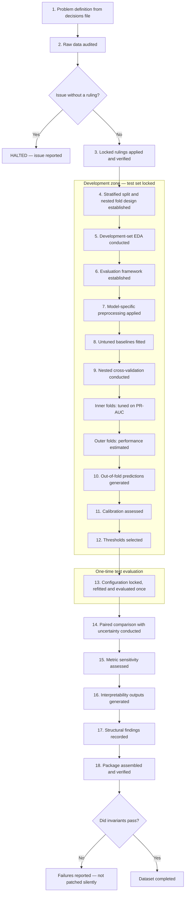

# Per-Dataset Analytical Workflow

This workflow was applied identically to every dataset. The governing constraint was that the holdout test set remained untouched until preprocessing, tuning, model selection, calibration assessment and threshold selection were all complete.

Every stage was tagged:

- **[FIXED]** — identical for every dataset. Changing it would break comparability between datasets.

- **[ADAPTABLE]** — varied by dataset. Supplied by that dataset's `decisions.md` before the run began.

**The decisions file was an input, not an output.** Every ADAPTABLE item was ruled on and locked before execution began. If the pipeline encountered an issue with no ruling, it halted at Stage 3 and reported it. It did not choose a resolution and continue.

**Scope.** This workflow produced evidence and recorded what was observed. It did not interpret results, draw conclusions, or make recommendations. Interpretation was a separate downstream activity with its own specification.



---

## 1. Problem definition [ADAPTABLE]

The problem definition was read from the decisions file. Nothing was derived here.

The following were recorded:
- The binary target and which class was positive
- What one observation represented
- The decision the model would support
- The stakeholder
- What a false positive and a false negative each represented in this setting

It was recorded that the models were evaluated as classification and ranking systems, and that probability-level statements were made only where Stage 11 supported them.

---

## 2. Raw data audit [FIXED]

The immutable source file was loaded and kept unchanged; cleaning was performed inside reproducible code.

Its filename, retrieval date, licence and file hash were recorded. The expected row and column counts from the decisions file were asserted, with execution **halted on mismatch**.

The following were inspected and recorded:

- Dimensions and variable types
- Target distribution as both proportion and **absolute positive-class count**
- Missing values, including disguised codes such as `?`, blanks or sentinels
- Duplicate rows and duplicate identifiers
- Undocumented category codes
- Impossible or contradictory values
- Constant and near-constant columns
- Category frequencies and unusually rare categories
- Identifier columns
- Candidate leakage variables

Two further required outputs were produced:

1. **Leakage register.** Every variable unavailable at decision time was named here rather than discovered later.
2. **Target rate by row position.** Where the source documentation stated any ordering of rows, target rate over deciles of position was computed. This was run regardless of expectation and the result was recorded whichever way it fell.

No learned preprocessing was performed at this stage. Outliers were not removed automatically.

**Recorded compromise.** The audit inspected the full dataset before the Stage 4 split. This was accepted for structural inspection only, and every audit-driven decision was recorded in the decisions file so its influence remained auditable.

---

## 3. Apply and verify locked rulings [ADAPTABLE, pre-settled]

The decisions file supplied rulings on:

- Undocumented category codes
- Sentinel values
- Ordinal codes — retained raw or binned
- Legitimate negative values
- Duplicate rows — retained or dropped
- Identifier exclusion
- Leakage-variable treatment
- Display names for every feature

Each ruling was applied inside the pipeline, never to the raw file, and was verified as having taken effect. The following were recorded per ruling: the variable, the issue, the action taken, and a verification result.

**Halt condition.** Any data issue with no ruling in the decisions file stopped execution here. It was reported and execution did not proceed by selecting a resolution.

---

## 4. Split and fold design [FIXED]

The following design was used:

- Stratified 80/20 split on the target
- Single recorded random seed
- Nested development cross-validation: five outer stratified folds, three inner stratified folds

The dataset decisions file supplied one seed, which was applied to every stochastic component: splitting, fold construction, estimator randomness, randomised search, bootstrap resampling, permutation importance and SHAP sampling. Deterministic single-thread execution was used where supported; any unavoidable nondeterministic operation was recorded in `environment.json` and was still required to pass the Stage 18 reproduction check.

This scheme was used for every dataset without exception. Where the source documentation stated an ordering of rows, that ordering was reported in Stage 5 and did not alter the split.

Two invariants were maintained:

- **Shared folds.** The same split and the same fold indices were used by all four models. The fold indices were generated once and persisted; paired comparison in Stage 14 would otherwise have been invalid.
- **Locked test set.** It informed no preprocessing decision, no hyperparameter, no threshold, and no model selection.

---

## 5. Development-set EDA [FIXED]

EDA was computed on development data only. Each analysis was required to bear on how the models might diverge; not every possible chart was produced.

Required coverage included:

- Class balance
- Predictor–target relationships, distinguishing monotonic trends from threshold effects
- Correlated feature blocks — this verified and characterised the Stage 7 handling already locked in `decisions.md`
- Candidate nonlinearities and interactions
- Unusual observations

Where Stage 2 found variation in target rate across row position, it was reported here as an observed characteristic of the data.

Each finding was written as a statement about observed structure, paired with a **pre-model hypothesis** about how it might affect model behaviour, to be revisited descriptively in Stage 17. Stage 5 did not determine, revise or optimise preprocessing after the development data had been examined.

---

## 6. Evaluation framework [ADAPTABLE]

The evaluation framework was declared before any model was fitted, preventing retrospective metric selection.

| Purpose | Metric |
|---|---|
| Primary model selection | PR-AUC, computed as average precision |
| Discrimination | ROC-AUC |
| Probability quality | Calibration slope and intercept, Brier score, log loss |
| Positive-class behaviour | Precision and recall at the declared operating point |
| Error profile | Confusion matrix, FP and FN counts |

The following were also read from the decisions file: the positive class; the threshold rule and its floor value; and how false positives and false negatives were described in this domain.

**Class imbalance was handled through metric choice and operating-point selection only.** PR-AUC was primary because it is sensitive to minority-class performance. No modification was made to the models, the loss, or the training data on account of imbalance.

Calibration was measured and recorded as a result in its own right.

---

## 7. Model-specific preprocessing [ADAPTABLE]

All learned transformations were contained inside pipelines and fitted within each fold: imputation → encoding → scaling where required → classifier. No transformation was fitted outside a fold.

**Correlated blocks and categorical encodings were handled per model family and the locked decisions file:**

- **Logistic regression** — correlated blocks were collapsed or pruned; ordinal codes were binned into interpretable buckets; numerics were scaled
- **Tree family (DT, RF, XGBoost)** — raw quantitative and ordinal values were retained; nominal variables were encoded as specified in `decisions.md`; no scaling was applied

The reason was that collinearity destabilises logistic regression coefficients, which were read directly in Stage 16, while tree models are unaffected and lose information under collapse.

**Required record.** The four models therefore did not receive identical feature matrices. A table was produced showing exactly which columns each model received, so the difference was documented rather than implicit.

---

## 8. Untuned baselines [FIXED]

All four models were fitted at untuned configuration on the shared folds, alongside a dummy classifier as a reference point. Dataset-level constraints that defined a model, including an interpretability depth cap, remained active; where `decisions.md` capped decision-tree depth, the baseline used that cap with all other estimator hyperparameters untuned. All baselines used the same locked preprocessing as their tuned counterparts.

Only the mean PR-AUC and fold standard deviation were recorded. This served as a reference point rather than a results table.

---

## 9. Nested cross-validation [FIXED procedure, ADAPTABLE spaces]

Five outer stratified folds, three inner stratified folds, shared fold indices, and the full pipeline inside every fold were used.

- **Inner loop** — hyperparameters were selected and scored by PR-AUC
- **Outer loop** — the selected configuration predicted the held-out outer fold

**Nested, not flat.** Reporting the best score from a hyperparameter search as a generalisation estimate is selection-optimistic, because the configuration was chosen on the folds it is reported from. Nested cross-validation separated selection from estimation. Both the inner-loop search score and the nested estimate were recorded for each model, so any divergence between them was visible.

**`search_score` had one definition.** It was the mean, across the five outer folds, of the best inner-search score achieved within that fold. It was the selection-optimistic quantity, and its gap from the nested estimate was the measurement of selection optimism. A search run on the complete development set was treated as a different quantity and was not recorded under this name; where the final refit required one, it was recorded separately as `final_fit_search_score`.

**Final-fit configuration.** After nested estimation and before the test set was touched, the same three-fold randomised search was run once on the complete development set, using the same search space, `n_iter`, scoring rule and seed. Its best score was recorded as `final_fit_search_score` and its selected parameters as `final_fit_params_json`. This search supplied the single locked configuration refitted in Stage 13. Stage 10 OOF predictions remained the held-out outer-fold predictions from nested CV; they were not regenerated from the final-fit search.

Two constraints were placed on the search:

- **Equal budget.** Identical `n_iter` and seed were used across all four models. Both were recorded.
- **Bounded tree depth.** The decision tree maximum depth was capped at the value given in the decisions file. The search did not exceed it.
- **Estimator determinism.** The dataset seed was set on every estimator exposing a randomness parameter. Deterministic single-thread settings were used where supported, including the ensemble estimators.

The following were recorded per model:

- Selected hyperparameters
- Mean outer-fold PR-AUC and fold standard deviation
- Per-fold PR-AUC values
- Inner-loop search score
- Complexity proxies — non-zero coefficient count for LR; realised depth and leaf count for DT; `n_estimators` and depth for the ensembles

---

## 10. Out-of-fold predictions [FIXED]

Out-of-fold predicted scores were generated for every model, so that every development observation was predicted by a model trained without it.

These fed Stages 11 and 12, which kept calibration assessment and threshold selection off the test set.

---

## 11. Calibration assessment [FIXED]

The following were computed on OOF development predictions, per model:

- Reliability curve
- Calibration slope and intercept
- Brier score
- Log loss

Ten equal-frequency reliability bins were used. Calibration slope and intercept were estimated by fitting an unpenalised logistic regression of the outcome on the logit of the predicted probability, after clipping scores to `[1e-6, 1-1e-6]`. Whether slope and intercept were close to one and zero respectively was recorded. Where they were not, it was recorded that the scores were to be treated as ranking devices only, and Stage 12 language was constrained accordingly. A convergence or identification failure was recorded as undefined and failed the relevant verification check; it was not silently repaired.

**No post-hoc recalibration was applied.** Calibration was measured, not repaired.

---

## 12. Threshold selection [ADAPTABLE floor]

Threshold selection was run on OOF predictions for all four models. For each model, every distinct finite OOF score was evaluated as a threshold using `predicted_positive = (score >= threshold)`. This candidate grid was exhaustive for every non-empty predicted-positive set induced by the scores. A threshold above the maximum score was not added, and a synthetic precision-recall endpoint with zero predicted positives was not treated as a candidate. Predicted-positive support, precision, recall and all four confusion-matrix counts were recorded at each point.

**One rule, two parameters.** Constrained optimisation was used: one metric was floored at the declared level and the other was maximised. Which metric was floored, and at what value, were read from the decisions file and were not chosen here. Both had been fixed before the sweep was inspected.

Four constraints were applied:

- All four models used the identical rule and floor
- **Attainment.** A floor was treated as guaranteed only where the metric and allowed candidate grid made that guarantee explicit; a recall floor in `[0, 1]`, for example, was attained at the minimum score because every positive was selected. Failure of a guaranteed floor halted execution as a defect. For a metric without that guarantee — including precision, F1 and specificity under the required non-empty selection rule — non-attainment was treated as a legitimate result. The operating point was set at the threshold maximising the floored metric, the fallback tie-break declared in `decisions.md` was applied, non-attainment was recorded and execution continued. **The floor was never lowered and never re-tuned per model.** The case followed from the locked metric and candidate rule, not from inspection of favourable results
- Every selected operating point predicted at least one positive case
- The selected threshold was recorded alongside the value each metric took at the conventional `0.50` probability threshold, which served as a reference point only. If `0.50` predicted no positives, precision was recorded as `0` and predicted-positive support as `0`; that reference point was never eligible for selection unless it was also one of the non-empty score candidates

The constrained and fallback tie-breaks were applied exactly as declared in `decisions.md`. The fallback order began by maximising the floored metric; it did not reuse a constrained tie-break whose first step maximised the other metric.

Where the decisions file stipulated a cost ratio for a sensitivity check, the threshold under that ratio was additionally recorded, together with whether the model ordering changed.

**Recording non-attainment.** `thresholds_selected.csv` carried the floored metric, floor value, optimised metric, selection mode, support and `floor_attained` boolean for every model, so none was inferred later. `selection_mode = "constrained"` was used when the floor was attained and a dataset-declared fallback label otherwise. Where any model recorded `FALSE`, Stage 15's threshold-metric rankings stated which models attained the floor and which did not. Stage 14 comparative claims rested on PR-AUC rather than threshold metrics and were unaffected. Non-attainment under a non-guaranteed floor was reported as observed.

---

## 13. Lock, refit, single test evaluation [FIXED]

Preprocessing, feature sets, hyperparameters, operating thresholds and the primary metric were locked. Each locked pipeline was refitted on the full development set.

Each was evaluated once on the untouched test set. The following were recorded:

- PR-AUC with a bootstrap 95% confidence interval — 5,000 stratified percentile resamples, fixed seed, with identical resampled indices reused across all four models
- ROC-AUC
- Calibration slope
- Precision, recall and the confusion matrix at the Stage 12 thresholds

**Prohibited after this stage ran:** retuning; reselecting thresholds; resplitting; changing preprocessing. Nothing downstream altered anything upstream. If a defect was found after test evaluation, it was reported rather than silently corrected and re-run.

**Authorised re-run.** A further complete run required explicit written authorisation naming the defects it corrected. The authorisation was recorded in the deviations table, prior outputs were discarded in full rather than patched, and the new run became the record. Absent that authorisation, the prohibition above stood without exception.

The exact reproduction run required by Stage 18 was not treated as an analytical re-run: it changed no choice, wrote to a separate verification directory, could not influence the retained outputs and was authorised solely to test determinism.

---

## 14. Paired comparison with uncertainty [FIXED]

Three components were used.

**Dispersion** — per-model per-fold mean and standard deviation were recorded, labelled as dispersion and not as a confidence interval, since k-fold folds are not independent.

**Paired differences** — for every model pair, the per-fold difference in PR-AUC on the shared folds was computed. The mean difference, the standard deviation of the differences, and the number of folds on which the sign agreed were recorded.

**Holdout uncertainty** — the bootstrap interval from Stage 13 was used.

**No significance testing was performed.** Comparison was by effect size and stability only: the size of the gap relative to fold-to-fold variation, the consistency of its direction, and the bootstrap interval. The words *significant*, *significantly*, *statistically significant* and *p-value* did not appear anywhere in the outputs in relation to differences between models or metrics.

---

## 15. Metric sensitivity [FIXED]

Every Stage 15 metric was computed from the pooled OOF development predictions. Test-set metrics remained confirmation evidence and never determined these rankings.

The four models were ranked under each of:

- PR-AUC
- ROC-AUC
- Precision at the operating threshold
- Recall at the operating threshold
- Calibration slope proximity to one

The rankings were tabulated side by side and whether the ordering changed between metrics was recorded.

**Stage 14 took precedence.** The development evidence from Stage 14 governed every comparative claim. Stage 15 recorded whether an ordering was stable under a change of metric; it was not treated as an independent ranking of the models. Where the two disagreed, Stage 14 stood and the disagreement was recorded as an observation. This precedence was stated in the output so the two could not be read as competing verdicts.

---

## 16. Interpretability outputs [FIXED]

Three components were applied to all four final models; the tuned configurations were refit on the full development set.

### (a) Native evidence

| Model | Recorded evidence |
|---|---|
| Logistic regression | Coefficients, signs, odds ratios, non-zero count — reported per encoded term |
| Decision tree | Decision rules, split thresholds, representative paths, realised depth and leaf count |
| Random forest | Impurity importance and permutation importance |
| XGBoost | Gain importance and permutation importance |

**One-hot coefficients had no defensible variable-level aggregate.** Any summation rule would reward cardinality rather than influence: a ten-level nominal variable contributes nine terms and would outrank a single strong predictor on the sum of their magnitudes. Logistic regression coefficients were therefore reported at the level at which they existed, one row per encoded term, and `native_vs_perm_rank_corr` was left blank for that model with the reason stated. No aggregate was constructed to fill the column.

That the tree family had a variable-level native importance and the logistic regression did not was itself recorded as an observation about what feature importance means across model families, and belonged in Stage 17.

**Data source.** Native fitted-model evidence was computed from the final refit model. Permutation importance was cross-fitted: for each outer fold, one original input variable was jointly permuted in that fold's held-out validation rows, the corresponding fitted outer-fold pipeline was scored using average precision and the process was repeated 30 times using the dataset seed. The per-fold/per-repeat permutation was derived deterministically from that seed and the same row permutation was reused across variables within a fold/repeat, giving paired perturbations. Nominal variables were permuted before encoding so all of their dummy terms moved together. For each variable, the arithmetic mean and sample standard deviation of the 150 fold-repeat score decreases were reported; folds received equal weight. Fold-level means were preserved in the registry. The test set was never used.

### (b) SHAP — all four models

SHAP was computed under an explicit, version-recorded configuration for every model and every dataset:

- Tree explainer for DT, RF and XGBoost; linear explainer for logistic regression
- The positive-class output was selected explicitly and the explainer output scale was recorded
- The final refit model was used
- **Development-set rows** were capped at 2,000 by stratified subsampling with seed 42; all rows were used when the development set was smaller than the cap
- A stratified development-data background sample of exactly `min(200, n_development)` rows was used, with seed 42

All interpretability evidence was development-derived, never test-derived. Permutation importance used held-out outer-fold development predictions; SHAP and fitted-model native evidence used the final refit model and development rows.

The actual row count used and the output scale each explainer produced were recorded.

**Comparison across models was restricted to feature rankings and directions of influence.** SHAP magnitudes were not compared between models, because explainer output scales differed. Where a common quantitative scale was required, permutation importance was used, which was computed identically for every model.

The logistic regression pipeline encoded and scaled its inputs, so SHAP operated on the transformed matrix. Feature names were recovered from the fitted preprocessor.

**Reducing encoded terms to variable level.** Any model receiving one-hot terms was reduced to the original-variable level for SHAP comparison. For each row, the **signed** contributions of all terms belonging to a variable were summed, the absolute value was taken, and the result was then averaged across rows:

```
variable_shap = mean_over_rows( | sum_over_terms( signed_shap ) | )
```

Summing absolute values across terms was prohibited. Under one-hot encoding every term carries a non-zero contribution even when its indicator is zero, so summing magnitudes accumulates contributions that would partly cancel, and inflates a variable in direct proportion to its number of levels. For tree native importance, non-negative dummy-term importances were summed to original-variable level. Permutation importance was already computed at original-variable level and was never reconstructed by summing dummy-level permutations.

**Direction convention.** For quantitative, ordinal and binary variables, Spearman correlation was calculated between the original feature value and the signed variable-level SHAP contribution. `positive` was recorded for rho at least 0.10, `negative` for rho at most -0.10, and `mixed/weak` otherwise; rho was stored in the model's SHAP summary. Nominal-variable direction was recorded as `category-dependent`, with term-level evidence retained.

### (c) Required comparison artefacts

Two files with fixed schemas, identical across datasets, were produced.

**Combined feature rankings.** One row per feature and one column per model gave that model's rank for that feature under permutation importance, plus its SHAP rank and direction of influence. This made the four models comparable in a single view.

**Ranking and tie convention.** Original variables were ranked by descending measured importance. Exact numerical ties were broken by ascending raw feature name and unique ordinal ranks `1..p` were then assigned; this rule also selected exactly ten features for every top-ten set. The same rule was applied to permutation, SHAP and tree-native rankings. Negative permutation importance remained valid and ranked below zero or positive importance rather than being clipped. The tie-break feature name was stored even where display names were used in presentation.

**Interpretability summary.** One row per model recorded the measured values that described it. `tree_depth` and `n_leaves` were populated for the random forest and XGBoost as well as the decision tree, taken from the Stage 9 complexity proxies, with the summarising statistic stated. `native_vs_perm_rank_corr` was Spearman correlation at original-variable level and was blank for logistic regression. `perm_vs_shap_rank_corr` was the within-model Spearman correlation of original-variable ranks. `top10_overlap_[model]` was the integer count from 0 to 10 of original variables shared between the row model's and named model's permutation-importance top ten; diagonal values were 10. Columns were left blank only where no value existed for that model family, and the reason was recorded.

---

## 17. Structural findings [FIXED]

The Stage 5 statements were revisited and what the completed analysis showed was recorded from the data rather than from the scores:

- Whether predictive information was concentrated in a small set of features or spread across many
- Which predictors carried the dominant signal, and in which direction
- Whether relationships appeared monotonic, or showed threshold effects
- Whether the decision tree found stable thresholds or fragmented
- Whether there was evidence that the ensembles used structure the linear model could not represent, and what that evidence was
- Whether the four models identified the same dominant predictors
- How class balance and absolute positive-class count related to what was observed

**Observations, not conclusions, were recorded.** Every statement named the specific evidence that produced it: which model, which measure, and what the values were. A structural statement required interpretability or EDA evidence; the fact that one model scored higher was not treated as such evidence. Where the evidence did not support a statement, this was recorded. It was not stated that a model performed better *because* of a structure, no model was recommended, and no research question was answered. Stage 5 hypotheses remained labelled as pre-model hypotheses.

Language remained associational throughout: *associated with*, *predictive of*, *contributes to the model prediction*. Not *causes* or *leads to*.

---

## 18. Package assembly and verification [FIXED]

The complete results package was assembled and verified before the dataset was considered finished.

1. Every reported number was written to long-form `outputs/registry.csv` with its source stage, model where applicable, scope, metric, source file, seed applicability and code version. The expected `(stage, model, scope, metric)` key set was declared in `outputs/registry_expected_keys.csv` and an exact match was required, so nothing was reported that could not be traced.
2. Produced files were checked against the declared manifest — both missing files and unexpected extra files were reported.
3. `tests/test_invariants.py` was run and the result was recorded.
4. The registry schema was confirmed to match the schema used for every other dataset.
5. Seeds, package versions including the SHAP version, and total run time were recorded.
6. The locked pipeline was re-run into a separate temporary verification directory with identical code, inputs, versions and seeds. Deterministic single-thread execution was used where supported. Retained numeric outputs were compared to at least five decimal places. A mismatch failed verification; neither run was selected because it was more favourable.

---

## Invariant checks [FIXED]

These were run at the end of every dataset and failed loudly where violated. They encoded the protocol, not merely whether the code executed.

- Fold index arrays were hash-identical across all four models
- Train and test index sets were disjoint; test size matched the declared split proportion
- The threshold-selection function received an array of development length, never test length
- Calibration inputs were the OOF arrays; no calibration wrapper was fitted
- Every registry row carried the code version and declared whether a seed was applicable; seeded rows carried the seed
- Every PR-AUC was finite and within `[0, 1]`; a value at or below the matched dummy/prevalence baseline produced a recorded warning and polarity diagnostic rather than invariant failure
- Registry columns and dtypes were identical to the other datasets
- The actual registry key set exactly matched `registry_expected_keys.csv`, catching both silent omission and unexpected extra results
- Decision tree realised depth did not exceed the declared cap
- Every threshold-sweep row had a distinct finite threshold, predicted at least one positive case, and had confusion counts reconciling to development length
- Every row of `thresholds_selected.csv` carried the declared floor, selection mode, support and `floor_attained`. Where it was `TRUE`, the floored metric was at or above the floor and the constrained tie-break was reproduced exactly. Where it was `FALSE`, the selected threshold maximised the floored metric over the non-empty recorded sweep and the fallback tie-break was reproduced exactly
- Every selected threshold appeared exactly once in its model's sweep; `selection_input_rows` equalled development length; selected and conventional-threshold confusion counts reconciled
- Feature names in the logistic regression SHAP output matched the fitted preprocessor's output names
- Cross-fitted permutation inputs collectively covered every development index in its held-out outer fold and never included test indices; SHAP inputs had development length, never test length
- Importance ranks were unique integers `1..p`, exact ties followed ascending raw feature name, and every top-ten set contained exactly ten original variables

---
